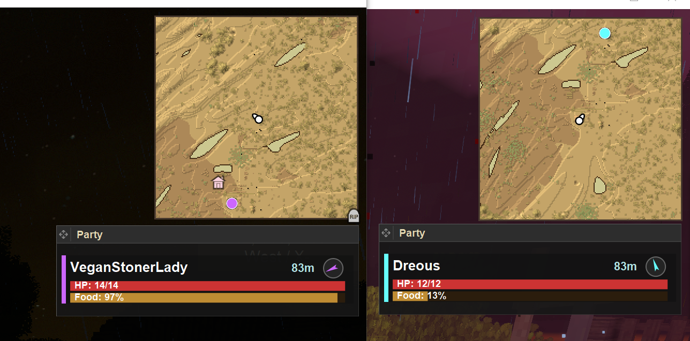
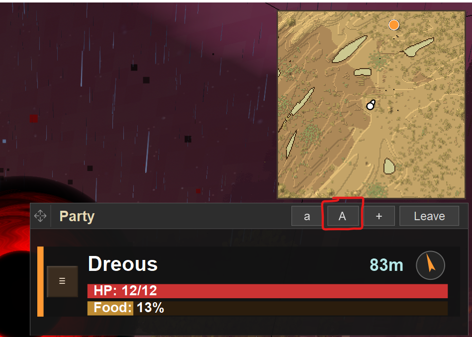
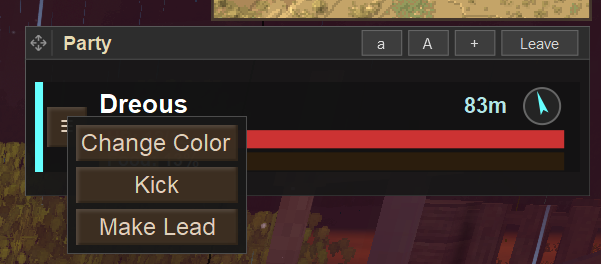
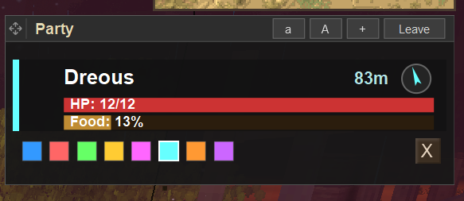
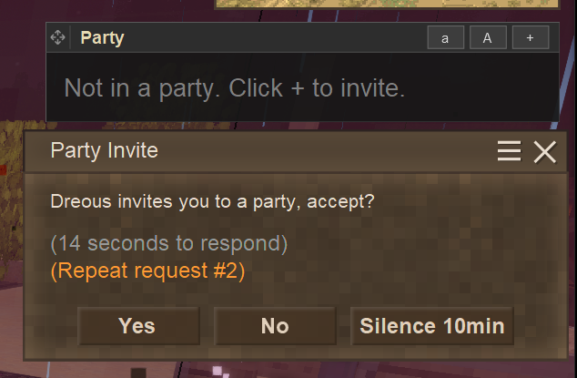
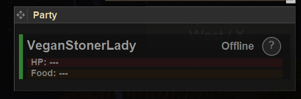

<h1 align="center">Buddy Beacon</h1>

  <em>Find your friends. Join your party. Adventure together.</em>

  
  
  

---

A lightweight multiplayer mod for staying connected with friends. Originally built so couples and small groups can adventure together without constantly losing each other.

**Use what you need** - each feature works independently.

---

## Party System

  

Group up with friends and always know where they are, how they're doing, and which direction to go.

**The Party HUD shows:**
- **Distance** - How far away each member is
- **Direction Compass** - Arrow pointing toward each party member
- **Health Bar** - Monitor your friends' HP at a glance
- **Food Bar** - Know when someone needs to eat
- **Minimap Pins** - Party members appear on your minimap

### Size Options

Toggle between compact and expanded views with the `a` / `A` buttons.

  

### Party Management

Right-click a party member for options:

  

- **Change Color** - Customize each member's accent color
- **Kick** - Remove a member (leader only)
- **Make Lead** - Transfer leadership

  

### Invites

Click `+` to invite players. They'll receive a prompt with options to accept, decline, or temporarily silence invites.

  

### Offline Handling

Party persists when members disconnect - they'll show as offline until they return.

  

---

## Beacon Band + Map Tracking

A simple bracelet that links players together for map visibility.

- **Right-click** to set a beacon code (any word or phrase)
- Players with **matching codes** see each other on the **world map**
- Green markers show friend locations with **distance**
- **Ping locations** to share points of interest
- Just keep it in your inventory - no need to wear it

Great for larger groups or guilds where a formal party isn't needed.

---

## Server Admin Tools

Optional items for servers with distant spawn points (5k+ blocks apart). Useful for letting new players immediately join friends.

| Item | Effect |
|------|--------|
| **Wayfinder's Compass** | Teleport TO a friend (consumed on use) |
| **Hero's Call Stone** | Summon a friend to YOU (consumed on use) |

*Tip: Provide these at spawn along with a temporal gear so new players can immediately reach friends and bind nearby.*

---

## Installation

1. Download from [Mod DB](https://mods.vintagestory.at/buddybeacon)
2. Drop the `.zip` in your `VintagestoryData/Mods` folder
3. Restart the game

---

## Configuration

Server admins can customize in `ModConfig/VSBuddyBeacon.json`:

<b>Config Options</b>

| Option | Default | Description |
|--------|---------|-------------|
| `BeaconUpdateInterval` | 1.0 | Seconds between position updates |
| `MaxBeaconGroupSize` | 10 | Max players per beacon code (0 = unlimited) |
| `EnableMapPings` | true | Allow map ping feature |
| `EnableDistanceLod` | true | Reduce update frequency for distant players |
| `HealthDataMode` | OnChange | When to send health: `Always`, `OnChange`, `Never` |
| `HealthChangeThreshold` | 1.0 | Min HP change to trigger update |
| `SaturationChangeThreshold` | 25 | Min hunger change to trigger update |

---

  Made for adventuring with the people you care about

